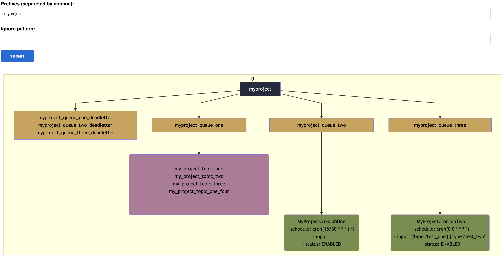

# AWS Sauron

A better looking for AWS SQS, SNS and Cloudwatch Events.

If your architecture is based on this services, this project may help you have a good overview of how things are connected.

Lets say you have multiple SQS queues, some of them subscribe for some SNS Topics, some of them receive events from Cloudwatch rules. With Amazon console it is hard to see it, even further if you have a lot of it. AWS Sauron intends to help you with that.

## Example



## AWS keys
Before you start, you must have `AWS_ACCESS_KEY_ID` and `AWS_SECRET_ACCESS_KEY`.

Check [here](https://docs.aws.amazon.com/general/latest/gr/aws-sec-cred-types.html#access-keys-and-secret-access-keys) to find out how get yours.

## Setup

### Manual Setup

1. You must have this dependencies installed
```
elixir 1.10.1
erlang 22.2.7
nodejs 13.9.0
```

2. Clone the repository
```
 git clone git@github.com:brunozrk/aws_sauron.git
```

3. Install dependencies with
```
 mix deps.get
 npm install --prefix apps/web/assets
```

4. Run the server
```
AWS_ACCESS_KEY_ID=<REPLACE> \
AWS_SECRET_ACCESS_KEY=<REPLACE> \
mix phx.server
```

Now you can visit [localhost:4000](http://localhost:4000/) from your browser.

### Docker Setup
```
docker run \
  --env AWS_ACCESS_KEY_ID=<REPLACE> \
  --env AWS_SECRET_ACCESS_KEY=<REPLACE> \
  --env AWS_REGION=us-east-1 \
  -p 4000:4000 \
  brunozrk/aws_sauron
```
